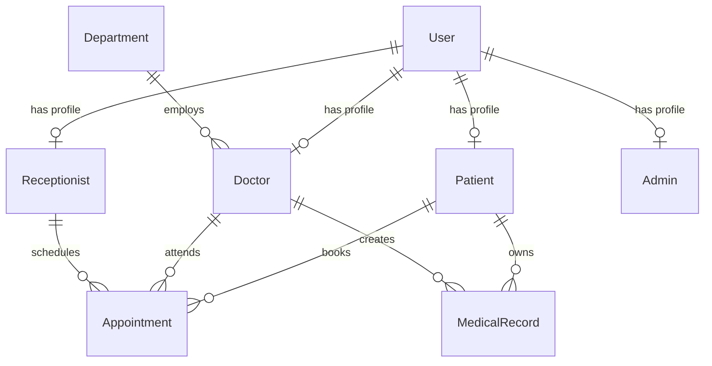

# 🏥 Jimma Medical Center — Patient Management System (MediCare Cloud)

A modern, highly secure, and responsive Patient Management System designed to streamline clinical workflows for healthcare organizations. Built with **Next.js 16**, **React 19**, **Prisma ORM**, **PostgreSQL**, and **Better Auth**, it provides tailored portals for Patients, Doctors, Receptionists, and Administrators.

---

## 📖 Table of Contents

1. [Key Features](#-key-features)
2. [Tech Stack](#-tech-stack)
3. [Portals & Roles](#-portals--roles)
4. [Database & Models](#-database--models)
5. [Project Structure](#-project-structure)
6. [Getting Started](#-getting-started)
7. [Environment Variables](#-environment-variables)
8. [Database Seeding & Demo Accounts](#-database-seeding--demo-accounts)
9. [Key Custom Systems](#-key-custom-systems)

---

## 🌟 Key Features

*   **Unified Role-Based Portals:** Dedicated dashboards for Administrators, Doctors, Receptionists, and Patients.
*   **Modern Authentication:** Fully integrated login, session, and role checking powered by **Better Auth** with a credentials provider.
*   **Smart Patient Search:** Multi-criteria search allowing Receptionists and Doctors to lookup patients instantly by **Name**, **Email**, **Phone**, or **Unique Card Number** (`BK-P-YYYY-XXXX`).
*   **Appointment Management:** Real-time appointment scheduling, doctor availability checking, status tracking (`SCHEDULED`, `COMPLETED`, `CANCELLED`, `RESCHEDULED`), and automated follow-up scheduling.
*   **Electronic Health Records (EHR):** Clinical record management where doctors can log diagnoses, input prescriptions, and write internal notes. Patients can securely access their own medical history.
*   **Robust Input Validation:** Standardized schemas (via `zod` & `react-hook-form`) across all registration forms, including localized phone formatting.
*   **Premium Dark/Light UI:** A unified **Midnight Navy & Ice Blue** design system supporting fluid dark mode transitions via `next-themes`.

---

## 🛠️ Tech Stack

*   **Frontend Core:** React 19.2.4 (Next.js 16.2.5 App Router & Turbopack)
*   **State Management:** Redux Toolkit & React Redux (pre-installed for global state requirements)
*   **Styling:** Tailwind CSS v4, `@tailwindcss/postcss`, `class-variance-authority`, `lucide-react` icons
*   **Authentication:** Better Auth 1.6.9 (with Prisma Adapter)
*   **Database & ORM:** PostgreSQL database accessed via Prisma Client 6.19.3
*   **Form & Validation:** React Hook Form 7.75.0, Zod 4.4.3, `@hookform/resolvers`
*   **Visualizations:** Recharts 3.8.1 (for admin analytics & dashboard metrics)

---

## 👥 Portals & Roles

### 👑 1. Administrator Portal
*   Create and manage clinical departments (e.g., Cardiology, Pediatrics, Orthopedics).
*   Add and onboard new Doctors and Receptionists to the system.
*   Monitor system-wide metrics: total patient counts, appointment queues, doctor workloads, and active staff.

### 👨‍⚕️ 2. Doctor Portal
*   View daily scheduled appointments and update appointment statuses.
*   Access complete medical records and patient consultation history.
*   Log new medical records (diagnosis, prescription, clinical notes).
*   Search for any patient in the hospital registry using name, email, phone, or card number.

### 👩‍💻 3. Receptionist Portal
*   Register new patients with formatted details.
*   Book and schedule appointments for patients with any available doctor.
*   Verify doctor availability in real-time before scheduling.
*   Search patient registries to check existing appointments or clinical cards.

### 🤒 4. Patient Portal
*   Self-register an account securely.
*   Book medical appointments by selecting preferred departments, doctors, dates, and times.
*   Review upcoming and historical appointments.
*   Access medical record history, diagnoses, and prescriptions given by doctors.

---

## 🗄️ Database & Models

The database schema (`prisma/schema.prisma`) comprises the following principal models:



*   **User:** Base account model storing common authentication and contact info (name, email, password, phone, role, gender).
*   **Patient:** Contains patient-specific metrics: Date of Birth, Age, Blood Type, and the unique `cardNumber`.
*   **Doctor:** Represents specialized practitioners linked to a specific `Department`.
*   **Receptionist & Admin:** System operator records linking users to staff permissions.
*   **Appointment:** Maps patient, doctor, and receptionist scheduling data, timestamps, reasons, and status.
*   **MedicalRecord:** Standard EHR entity recording diagnosis, prescription, doctor notes, and timestamps.
*   **Department:** Medical sectors grouping doctors together.

---

## 📂 Project Structure

```text
patient-management-system/
├── app/                      # Next.js App Router pages & API routes
│   ├── api/                  # API endpoints (auth, patients, appointments, etc.)
│   ├── dashboard/            # Role-based dashboards (admin, doctor, patient, receptionist)
│   ├── login/                # Authentication page
│   ├── register/             # Self-registration page
│   ├── globals.css           # Global Tailwind styles & CSS variables
│   └── layout.tsx            # Root layout & providers (Theme, Auth, Redux)
├── components/               # Reusable UI components
│   ├── ui/                   # Shadcn/ui baseline components (button, card, dialog, etc.)
│   ├── layout/               # Shared dashboard layout components
│   └── admin/                # Admin-specific modal & components
├── lib/                      # Core utility functions & shared logic
│   ├── auth.ts               # Better Auth server configuration
│   ├── auth-client.ts        # Better Auth client configuration
│   ├── prisma.ts             # Instantiated Prisma Client
│   ├── phone-format.ts       # Phone number parsing & Ethiopian formatters
│   └── validations.ts        # Shared Zod forms validation schemas
├── prisma/                   # Database schema & migrations
│   ├── schema.prisma         # Prisma schema definition
│   └── seed.ts               # Seeding script containing dummy dataset
└── public/                   # Static assets (images, icons)
```

---

## 🚀 Getting Started

### 📋 Prerequisites
Ensure you have the following installed on your machine:
*   [Node.js](https://nodejs.org/) (v18.x or later recommended)
*   [PostgreSQL](https://www.postgresql.org/) database instance running locally or hosted

### ⚙️ Installation

1.  **Clone the Repository:**
    ```bash
    git clone <repository-url>
    cd patient-management-system
    ```

2.  **Install Project Dependencies:**
    ```bash
    npm install
    ```

3.  **Configure Environment Variables:**
    Create a `.env` file in the root directory and configure it as shown in the [Environment Variables](#-environment-variables) section.

4.  **Synchronize Database Schema:**
    Run the Prisma command to push the schema into your PostgreSQL database:
    ```bash
    npx prisma db push
    ```

5.  **Seed the Database:**
    Populate your database with departments, doctors, receptionists, patients, and sample appointments:
    ```bash
    npx prisma db seed
    ```

6.  **Run the Local Development Server:**
    ```bash
    npm run dev
    ```
    Open [http://localhost:3000](http://localhost:3000) in your browser to access the app.

---

## 🔑 Environment Variables

Create a file named `.env` in the root of the project:

```env
# Database connection string
DATABASE_URL="postgresql://<username>:<password>@localhost:5432/<database_name>?schema=public"

# Better Auth secret key (can be generated using: openssl rand -base64 32)
BETTER_AUTH_SECRET="your_better_auth_secret_here"

# Core application URL
BETTER_AUTH_URL="http://localhost:3000"
```

---

## 🗃️ Database Seeding & Demo Accounts

The seed script (`prisma/seed.ts`) populates the database with sample records. All accounts share the same password: **`password123`**.

| Name | Role | Email Address | Notes |
| :--- | :--- | :--- | :--- |
| **Admin User** | `ADMIN` | `admin@hospital.com` | Full database/staff control |
| **Sarah Johnson** | `RECEPTIONIST` | `receptionist1@hospital.com` | Frontdesk / Scheduling |
| **Emily Davis** | `RECEPTIONIST` | `receptionist2@hospital.com` | Frontdesk / Scheduling |
| **Dr. Michael Chen** | `DOCTOR` | `doctor1@hospital.com` | Cardiologist |
| **Dr. Sarah Williams** | `DOCTOR` | `doctor2@hospital.com` | Pediatrician |
| **Dr. James Anderson** | `DOCTOR` | `doctor3@hospital.com` | Orthopedic Surgeon |
| **Dr. Lisa Martinez** | `DOCTOR` | `doctor4@hospital.com` | Neurologist |
| **Dr. Robert Taylor** | `DOCTOR` | `doctor5@hospital.com` | Dermatologist |
| **Dr. Amanda White** | `DOCTOR` | `doctor6@hospital.com` | General Medicine GP |
| **John Smith** | `PATIENT` | `patient1@example.com` | Card: `BK-P-2026-0001` |
| **Emma Brown** | `PATIENT` | `patient2@example.com` | Card: `BK-P-2026-0002` |
| **David Wilson** | `PATIENT` | `patient3@example.com` | Card: `BK-P-2026-0003` |

---

## 🛠️ Key Custom Systems

### 📞 Localized Phone Validation
The application uses a custom validator in `lib/phone-format.ts` specifically optimized for Ethiopian phone numbers:
*   Allows prefixes `+2519`, `+2517`, `09`, or `07`.
*   Standardizes phone input before storing it in the database in the format `+251xxxxxxxxx`.
*   Validates length and starting digits to prevent malformed data.

### 💳 Patient Unique Card Numbers
Each registered patient is allocated a structured clinical card number.
*   Format: `BK-P-{YEAR}-{FOUR_DIGIT_AUTO_INCREMENT}` (e.g., `BK-P-2026-0001`).
*   Indexed and unique `@unique` constraint in the schema for rapid lookups.
*   Seamlessly integrated into the global search bar across Receptionist and Doctor dashboards.
